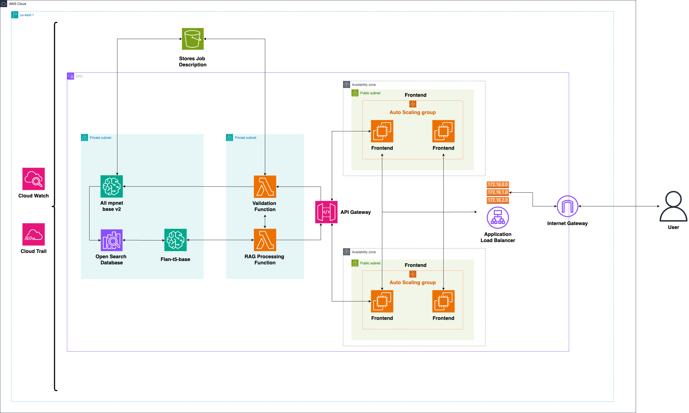

# Intprep - (Cloud based Gen-AI interview helper)

<div align="center">

</div>

## Overview

AI Interview Coach is a cloud-based application designed to generate personalized interview questions based on job descriptions. It leverages AWS services such as Lambda, SageMaker, OpenSearch, and S3 to provide a seamless experience for users preparing for job interviews.

## Features

- **Job Description Validation**: Ensures the input is valid and stores it securely in S3.
- **Question Generation**: Uses SageMaker and OpenSearch to generate relevant interview questions based on the job description.
- **Responsive Frontend**: A React-based user interface for interacting with the application.
- **Scalable Backend**: Built using AWS Lambda and API Gateway for serverless scalability.

## Architecture

<div align="center">

</div>

The application is built using a microservices architecture, with the following components:

1. **Frontend**: A React-based web application hosted on EC2 instances behind an Application Load Balancer (ALB).
2. **Backend**: AWS Lambda functions for input validation and question generation, integrated with API Gateway.
3. **Storage**: S3 for storing job descriptions and generated questions.
4. **Machine Learning**: SageMaker for generating interview questions using a pre-trained model.
5. **Search**: OpenSearch for querying relevant documents based on the job description.
6. **Authentication**: Cognito for user authentication and API Gateway authorization.

## Technologies Used

- **Frontend**: React, CSS
- **Backend**: Python (AWS Lambda)
- **Cloud Services**: AWS (Lambda, SageMaker, OpenSearch, S3, Cognito, API Gateway, CloudFormation)
- **Infrastructure as Code**: CloudFormation templates for provisioning resources

## User Flow

### Uploading Job Description

User uploads the job description taken from websites like LinkedIn, Indeed, or Company job portal

<div align="center">
<p float="left">
  
  
</p>
</div>

The application returns questions for inteerview preparation based on the job description

## Deployment

### Prerequisites

- AWS account
- Node.js and npm installed locally
- Docker installed locally (optional for containerized frontend)

### Steps

1. **Frontend**:
   - Navigate to the `frontend` directory.
   - Install dependencies: `npm install`.
   - Start the development server: `npm start`.
   - Build for production: `npm run build`.

2. **Backend**:
   - Deploy CloudFormation templates in the following order:
     - `network.yaml`
     - `storage.yaml`
     - `authentication.yaml`
     - `sagemaker-opensearch.yaml`
     - `api-gateway-lambda.yaml`
     - `frontend.yaml`

3. **Dockerized Frontend**:
   - Build the Docker image: `docker build -t ai-interview-coach .`.
   - Run the container: `docker run -p 3000:3000 ai-interview-coach`.

## API Endpoints

### `/validate`
- **Method**: POST
- **Description**: Validates the job description and stores it in S3.
- **Request Body**:
  ```json
  {
    "query": "Job description text"
  }
